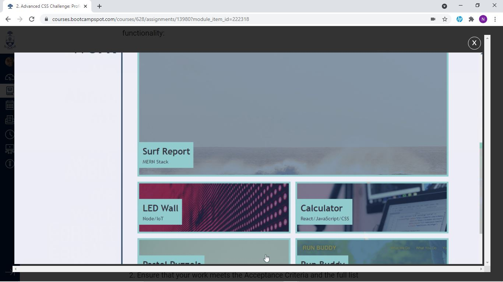

# my Story
AS AN employer
I WANT to view a potential employee's deployed portfolio of work samples
SO THAT I can review samples of their work and assess whether they're a good candidate for an open position
# Objective
GIVEN I need to sample a potential employee's previous work
WHEN I load their portfolio
THEN I am presented with the developer's name, a recent photo or avatar, and links to sections about them, their work, and how to contact them
WHEN I click one of the links in the navigation
THEN the UI scrolls to the corresponding section
WHEN I click on the link to the section about their work
THEN the UI scrolls to a section with titled images of the developer's applications
WHEN I am presented with the developer's first application
THEN that application's image should be larger in size than the others
WHEN I click on the images of the applications
THEN I am taken to that deployed application
WHEN I resize the page or view the site on various screens and devices
THEN I am presented with a responsive layout that adapts to my viewport
# Project result

# my page without css

# code was used to make page open in all browers
 <meta name="viewport" content="width=device-width, initial-scale=1.0">

 # favicon was added
 my image

 # Colors were tweak

 # links were make in cool stuffs

 # How to sumbit
 
How to Submit the Challenge
You are required to submit BOTH of the following for review:

The URL of the deployed application.

The URL of the GitHub repository that contains your code. Give the repository a unique name and include a README file that describes the project.

# Issues
Color format and level of opacity function calls
Trying to make th web-site looks similar to the expectation